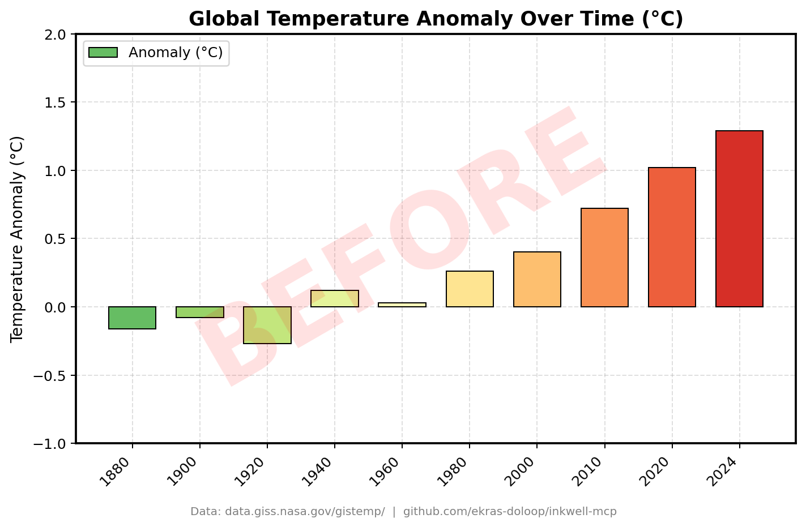
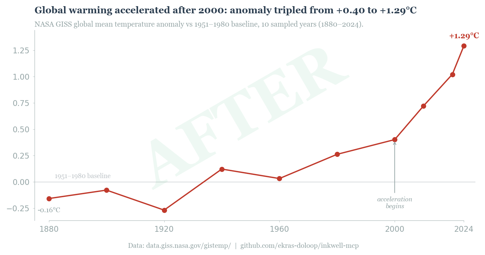

# Inkwell MCP

An adversarial chart reviewer that helps you improve your data-ink ratio and communicate more with your charts.

Inkwell reviews charts in two passes — **substance** (is the data real? does the title match?) then **style** (data-ink ratio, direct labeling, color restraint, white space). If it keeps rejecting on style alone, it escalates to a human instead of looping forever.

Built as an [MCP server](https://modelcontextprotocol.io/) for [Claude Code](https://docs.anthropic.com/en/docs/claude-code) and Claude Desktop.

## Before / After

Same data (NASA GISS global temperature anomaly, 1880-2024). The BEFORE fails Inkwell's substance check — the title describes the axes instead of stating a finding. The AFTER scores 16/16.

| Before | After |
|--------|-------|
|  |  |

**Before**: Rainbow gradient bars, gridlines, generic title ("Over Time"), unnecessary legend, rotated labels, y-axis extends to -1/+2 when data lives in -0.3/+1.3. Inkwell verdict: **SUBSTANCE_FAIL** (S3: title doesn't state a finding).

**After**: Title states the finding, subtitle names NASA GISS as source, direct labeling on endpoints, one color, range frames, meaningful annotation at the acceleration point. Inkwell verdict: **APPROVED, 16/16**.

Generate these yourself: `python examples/before_after.py`

## Why

LLM-powered chart review sounds great until you try it. The problems we hit:

1. **Infinite rejection loops.** "Be brutal" prompts cause the reviewer to reject everything forever. You fix what it asks, it finds new complaints. There's no finish line.
2. **Substance and style get tangled.** A font complaint overrides valid data. The reviewer tells you to change your visualization type when the data is correct.
3. **The reviewer hallucinates.** Vision models claim "sans-serif" on serif fonts, flag "gridlines" on gridless charts, and invent violations that don't exist.
4. **No memory across rounds.** The reviewer demands format A, you comply, then it rejects format A and demands format B.

Inkwell fixes all four:

- **Two-pass architecture** — substance and style are separate prompts with separate verdicts. A font quibble can't override valid data.
- **Finite scoring** — style is scored 0/1/2 on 8 criteria. Total out of 16. You know exactly where you stand.
- **Anti-hallucination instructions** — "Score ONLY what you can see. If you can't identify the font, don't guess."
- **HITL escalation** — after 3 style-only rejections on the same chart, Inkwell stops and says "show it to a human." No more loops.

## Install

```bash
pip install mcp anthropic   # Anthropic backend
# or
pip install mcp openai      # OpenAI-compatible backend (Gemini, Nemotron, Ollama, etc.)
```

## Setup

### Claude Code

Add to `.mcp.json` in your project root:

```json
{
  "mcpServers": {
    "inkwell": {
      "command": "python3",
      "args": ["/absolute/path/to/inkwell.py"],
      "env": {
        "ANTHROPIC_API_KEY": "sk-ant-..."
      }
    }
  }
}
```

Restart Claude Code to pick up the new server.

### Claude Desktop

Add to `~/Library/Application Support/Claude/claude_desktop_config.json` (macOS) or `%APPDATA%\Claude\claude_desktop_config.json` (Windows):

```json
{
  "mcpServers": {
    "inkwell": {
      "command": "python3",
      "args": ["/absolute/path/to/inkwell.py"],
      "env": {
        "ANTHROPIC_API_KEY": "sk-ant-..."
      }
    }
  }
}
```

### OpenAI-compatible APIs

Use any vision-capable model via the OpenAI SDK (Gemini, Nemotron, Ollama, vLLM, LiteLLM, etc.):

```json
{
  "mcpServers": {
    "inkwell": {
      "command": "python3",
      "args": ["/absolute/path/to/inkwell.py"],
      "env": {
        "INKWELL_BACKEND": "openai",
        "INKWELL_OPENAI_API_KEY": "your-key",
        "INKWELL_OPENAI_BASE_URL": "https://generativelanguage.googleapis.com/v1beta/openai",
        "INKWELL_MODEL": "gemini-2.0-flash"
      }
    }
  }
}
```

## Configuration

Environment variables:

| Variable | Default | Description |
|----------|---------|-------------|
| `INKWELL_BACKEND` | (auto-detected) | `"anthropic"`, `"openai"`, or `"bedrock"` |
| `INKWELL_MODEL` | (per backend) | Model for reviews (must support vision) |
| `ANTHROPIC_API_KEY` | | Anthropic API key |
| `INKWELL_OPENAI_API_KEY` | | API key for OpenAI-compatible endpoint |
| `INKWELL_OPENAI_BASE_URL` | | Base URL for OpenAI-compatible endpoint |
| `INKWELL_HITL_THRESHOLD` | `3` | Style rejections before human escalation |
| `AWS_REGION` | `us-east-1` | Bedrock region |
| `INKWELL_BEDROCK_MODEL` | `us.anthropic.claude-sonnet-4-20250514-v1:0` | Bedrock model ID |

## Tools

### `review_chart`

Two-pass review of a chart image.

```
review_chart(
    image_path="/path/to/chart.png",
    context="Sales by region, Q1-Q4 2025. Source: internal CRM. Finding: APAC grew 3x while NA was flat.",
    code="<optional matplotlib code>"
)
```

**Pass 1 — Substance** (binary, fails fast):
- S1: Real data (not invented numbers)
- S2: Right form (chart type fits the data)
- S3: Visible argument (finding clear in 5 seconds)
- S4: Data integrity (title matches what chart shows)

If substance fails, style review is skipped. Fix the data first.

**Pass 2 — Style** (scored /16):
- C1: Data-ink ratio
- C2: Direct labeling (no legends needed)
- C3: Color restraint (max 2 meaningful colors)
- C4: Typography (title = finding, subtitle = data description)
- C5: White space (no cramped labels)
- C6: Range frames (axes span data, not round numbers)
- C7: Meaningful annotations
- C8: Context (whose data, what measured, sample size)

Scoring: >= 12 PASS, 8-11 NEEDS_WORK, < 8 FAIL.

### `review_history`

See all review rounds for a chart:

```
review_history(image_path="/path/to/chart.png")
```

### `reset_history`

Clear history after a major redesign:

```
reset_history(image_path="/path/to/chart.png")
```

### `chart_spec`

Ask Inkwell what charts a paper or report needs:

```
chart_spec(
    paper_text="<your paper text>",
    paper_title="Quarterly Sales Analysis"
)
```

Returns chart specifications with exact data requirements, recommended forms, and what to omit. Will tell you if the text doesn't have enough quantitative data for a chart.

## The HITL Gate

After 3 style-only rejections (substance passes each time), Inkwell stops reviewing and returns:

```
HITL ESCALATION: This chart has been rejected 3 times on style alone
(substance passes every time). Style scores across rounds: [11, 10, 11].
The automated reviewer may be looping. Show the chart to a human and ask:
'Does this chart communicate its finding clearly? Any label overlaps or
readability issues?'
```

This prevents the most common failure mode of LLM-powered review: infinite nitpick loops where the reviewer keeps finding new things to complain about.

## Example Workflow

1. Generate your chart with matplotlib/seaborn/plotly
2. Ask Claude to review it: *"Review my chart at figures/sales.png — it shows Q1-Q4 revenue by region"*
3. Claude calls `review_chart` → gets substance + style feedback
4. Fix what failed, regenerate, resubmit
5. After approval (or HITL escalation), you're done

Typical charts pass substance on the first try and reach style approval within 1-3 rounds.

## Origin

Built during the [Pneumae](https://github.com/ekras-doloop) research project, where we needed to review 18 data visualizations across 11 papers. The v1 reviewer ("Be brutal. You almost never approve.") created infinite rejection loops. v2 (Inkwell) solved this with the two-pass architecture and HITL gate. All 18 charts were approved within 1-3 rounds each.

## License

MIT
